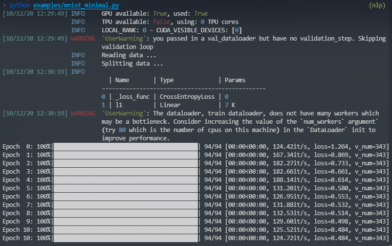

# plkit

A wrapper of [pytorch-lightning][1] that makes you write even less code.

[![pypi version][3]][4] [![github tag][5]][6] [![codacy quality][7]][8] [![coverage][9]][8] ![docs][10] ![building][11]

## Installation

```
pip install -U plkit
```

## Principles

- Being compatible with pytorch-lightning
- Using configurations instead of coding if possible

## Features
- Compatible with `pytorch-lightning`
- Exposed terminal logger
- Better formatted warnings and errors from `pytorch-lightning`
- Trainer from a dictionary (not only from an `ArgumentParser` or a `Namespace`)
- Data module with automatic split for train, val and test datasets
- Auto loss function and optimizer
- Optuna integration

## Usage

### From pytorch-lightning's minimal example

```python
"""A minimal example for plkit"""

from pathlib import Path
import torch
from torchvision import transforms
from torchvision.datasets import MNIST
from plkit import Module, DataModule, run

class Data(DataModule):

    def data_reader(self):
        return MNIST(Path(__file__).parent / 'data', train=True,
                     download=True, transform=transforms.ToTensor())

class LitClassifier(Module):

    def __init__(self, config):
        super().__init__(config)
        self.l1 = torch.nn.Linear(28 * 28, 10)

    def forward(self, x):
        return torch.relu(self.l1(x.view(x.size(0), -1).float()))

    def training_step(self, batch, _):
        x, y = batch
        loss = self.loss_function(self(x), y)
        return {'loss': loss}

if __name__ == '__main__':
    configuration = {
        'gpus': 1,
        'data_tvt': .05, # use a small proportion for training
        'batch_size': 32,
        'max_epochs': 11
    }
    run(configuration, Data, LitClassifier)
```



### Using exposed logger

```python
from plkit import logger

# Your logic

if __name__ == "__main__":
    # Now you are able to log something outside Modules
    logger.info('Fantastic starts ...')
    # ...
    logger.info('Pipeline done.')
```

### Best practice (Boilerplate)

You can use each objects (trainer, module, datamodule) as the way you do with `pytorch-lightning`, but we suggest you use them in the following ways:

#### Running locally

```python
from plkit import Module, DataModule, run

class MyData(DataModule):
    ...

class MyModel(Module):
    ...

if __name__ == '__main__':
    config = {
        ...
    }
    run(config, MyData, MyModel)
```

#### Running via SGE

```python
from plkit import Module, DataModule, SGERunner, run

# MyData and MyModel definitions

if __name__ == '__main__':
    config = {
        ...
    }
    sge = SGERunner(...)
    run(config, MyData, MyModel, runner=sge)
    # or
    sge.run(config, MyData, MyModel)
```

#### With optuna

```python
from plkit import (
    Module,
    DataModule,
    Optuna,
    OptunaSuggest,
    LocalRunner,
    run
)

# MyData and MyModel definitions

if __name__ == '__main__':
    config = {
        ...
        hparam1=OptunaSuggest(<default>, <type>, *args, **kwargs),
        hparam2=OptunaSuggest(<default>, <type>, *args, **kwargs),
    }
    runner = LocalRunner()
    # requires `val_acc` to be logged in `validation_epoch_end`
    optuna = Optuna(on='val_acc', n_trials=10, direction='maximize')
    run(config, MyData, MyModel, runner=runner, optuna=optuna)
    # or
    runner.run(config, MyData, MyModel, optuna)
```

## Resources

See more examples in `./examples` and [full documentation][2]


[1]: https://github.com/PyTorchLightning/pytorch-lightning
[2]: https://pwwang.github.com/plkit
[3]: https://img.shields.io/pypi/v/plkit?style=flat-square
[4]: https://pypi.org/project/plkit/
[5]: https://img.shields.io/github/v/tag/pwwang/plkit?style=flat-square
[6]: https://github.com/pwwang/plkit
[7]: https://img.shields.io/codacy/grade/60b6b06fa06c4539b4a7b48ba30fd2bb?style=flat-square
[8]: https://app.codacy.com/gh/pwwang/plkit
[9]: https://img.shields.io/codacy/coverage/60b6b06fa06c4539b4a7b48ba30fd2bb?style=flat-square
[10]: https://img.shields.io/github/workflow/status/pwwang/plkit/Build%20Docs?label=docs&style=flat-square
[11]: https://img.shields.io/github/workflow/status/pwwang/plkit/Build%20and%20Deploy?style=flat-square
